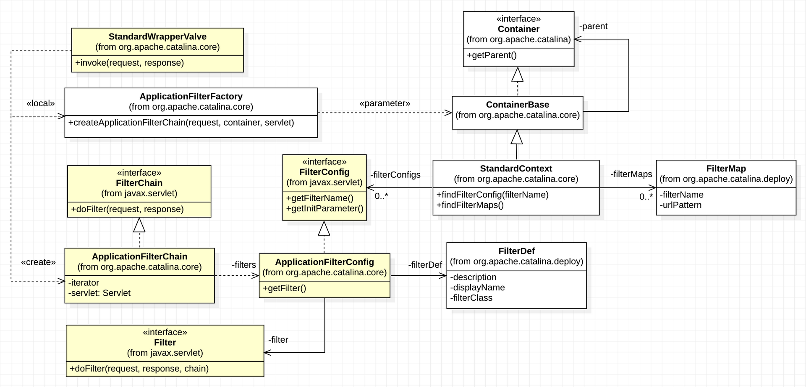
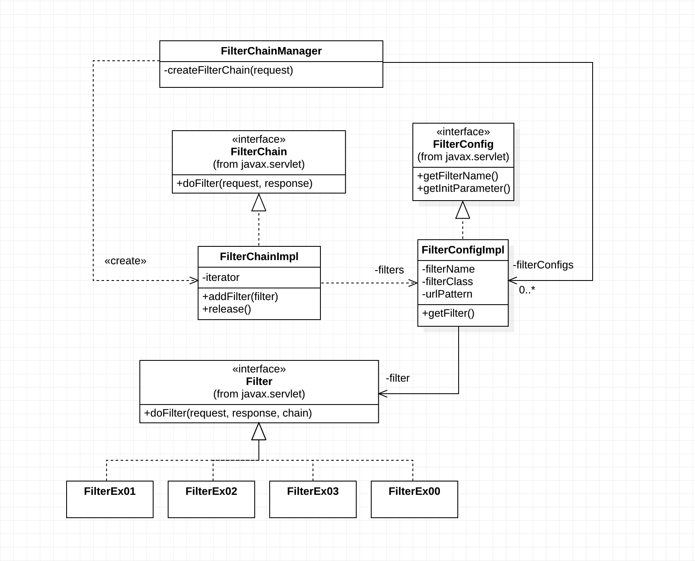

01. Servlet Filter

### JavaEE Application-level Security, Spring Security 그리고 Servlet Filter

세삼스럽지만 Spring은 JavaEE 애플리케이션 개발의 사실상 표준 프레임워크이다. 따라서 Spring Security도 JavaEE 개발의 사실상 "애플리케이션 레벨"의 표준 보안 프레임워크라 할 수 있다. 소프트웨어 시스템의 보안을 다룰 때는 소프트웨어 시스템을 여러 계층(Layer)으로 나누고 계층별 세분화 된 보안 주제를 다룬다. 예를 들면, 소프트웨어 시스템을 인프라 계층과 시스템 계층으로 나누어 볼 수 있다. 인프라 계층에서는 네트워크, 컴퓨팅, 운영체체(OS) 등으로 다시 세분화 하여 각각의 레벨에 맞는 보안 주제들을 다룬다. 마찬가지로 시스템 계층도 애플리케이션, 데이터 저장(데이터베이스) 등으로 나누고 각각의 레벨에 맞는 보안 주제를 다룰 수 있다.

Spring Security는 소프트웨어 시스템 보안에서 애플리케이션 레벨의 보안에만 집중한다. 애플리케이션 레벨에서 다루게 되는 보안 주제는 인증(Authentication)과 권한(Authorization)이다. Spring Security는 이 주제의 완벽한 구현을 지원한다. 여기에 한 가지 더, 대부분의 JavaEE 애플리케이션들이 웹을 기반하기 때문에 일반적인 웹 공격(OWASP TOP 10, https://www.owasp.org)에 대한 대응도 완벽히 지원한다.

Spring 기반의 애플리케이션은 실행, 실행환경 그리고 데이터 처리와 저장에 대한 대부분의 로직이 Spring Context 내의 다수의 Bean들로 구현된다. 따라서 Spring Security가 보호해야 할 대상은 Spring Context이고 더 구체적으로는 Spring Context가 관리하는 Bean의 실행이다.

Spring 기반의 애플리케이션은 모든 HTTP 요청(HttpServletRequest)을 Spring Context 내의 특정 Bean의 실행에 매핑한다. 그런데 HTTP 요청을 직접 받는 것은 Servlet Context 내의 DispatcherServlet 이다. 그렇기 때문에 DispatcherServlet이 요청을 받고 그 요청과 매핑된 Bean의 실행을 책임지게 된다. 간단하게 요약했지만 이것이 Spring MVC의 핵심이다.

Spring Context에 대한 보호 책임이 있는 Spring Security는 Servlet Context 내의 DispatcherServlet이 처리하는 모든 요청을 DispatcherServlet 보다 먼저 감시하고 보안 정책을 적용한다. 이를 가능하게 하는 기술이 Servlet Filter 이다. 보안이 간단치만은 않기 때문에 다수의 보안 Filter들이 순차적으로 설정된 보안 정책에 따라 감시하게 되며 최종적으로는 Servlet의 실행까지 책임진다. 이를 Filter Chain 이라 한다. Spring Security Architecture는 전적으로 Servlet Filter를 기반하고 있다.

그러면 왜? Servlet Security가 아니고 Spring Security 인가? 맞다. Servlet Filter는 이름에도 있지만 Servlet과 함께 Servlet Context에서 관리하는 컴포넌트다. 간단히 던진 질문이 아니기 때문에 대답도 그리 간단하지 않다. 대답을 하기 위해서는 먼저 JavaEE 응용 패턴인 Intercepting Filter Pattern을 Servlet Filter 그리고 Filter Chain과 함께 알아야 한다. 그 다음에 Proxy 디자인 패턴을 기본으로 질문의 대답인 Spring Security Architecture를 이해해야 한다.

### JavaEE Intercepting Filter Pattern

JavaEE 패턴 중 Intercepting Filter에 대한 내용은 wiki([https://en.wikipedia.org/wiki/Intercepting\_filter\_pattern](https://en.wikipedia.org/wiki/Intercepting_filter_pattern)) 을 보면 다이어그램들과 함께 잘 설명되어 있다. 요약하면, 요청에 대한 핵심처리(비즈니스)가 있고 여기에 부가적인 처리에 대한 필요가 생겼을 때, 핵심처리 코드의 수정 없이 부가적인 처리 코드를 filter로 구현하여 손쉽게 넣었다 뺐다 하는 패턴이다. Cross-cutting Concern(횡단관심) 분리를 적용할 수 있는 패턴이다. 실제로 Servlet Filter는 Servlet의 비즈니스 구현 코드에서 횡단 관심이라 볼 수 있는 Authentication, Logging, Auditing, Data compression, Encoding 등과 같은 코드들을 분리할 때 사용된다.

Intercepting Filter Pattern의 구현 전략(Strategy)은 여러 가지가 있다. 모든 전략들이 각각의 쓰임새(Use Case)가 있겠지만 여기서는 Tomcat과 Spring Security에 적용되어 있는 Custom Filter Strategy를 소개한다. 다른 구현 전략들과 비교되는 Custom Filter Strategy의 특징이 바로 Filter Chain 이다. Filter Chain에 연결된 각각의 Custom Filter 들이 순차적으로 클라이언트의 요청(ServletRequest)에 처리(전처리, Pre-processing)를 추가하고 최종 타겟이 되는 Servlet에게 그 요청을 전달하게 된다. Servlet은 이 요청을 처리하고 결과를 응답(ServletResponse)에 담아 Filter Chain의 Custom Filter들에게 다시 역순으로 전달한다. 요청에 대한 전처리와 마찬가지로 응답에도 Custom Filter 들의 후처리(Post-processing)가 추가되고 이 응답이 최종적으로 클라이언트에게 전달된다.

다소 복잡한 것 같지만 구현 예제와 테스트 코드를 보면 어렵지 않게 이해 할 수 있다. 이 전략은 FilterChain 구현이 필수이다. 그리고 Filter와 FilterChain을 관리하고 요청을 받았을 때 FilterChain을 생성하고 작동(invoke)시키는 Filter Chain Manager도 추가적으로 필요하다.

앞에서 Intercepting Filter Pattern의 Custom Filter Strategy가 적용된 좋은 사례(Best Practice)로 Tomcat과 Spring Security를 잠깐 언급하였다. 구현 예제와 테스트 코드를 살펴 보기 전에 둘 중에 Tomcat 구현을 조금 복잡하기는 하지만 잠깐 살펴보자. 다음은 Tomcat에서 Filter Chain 생성과 동작에 관련된 클래스들과 관계를 표현한 다이어그램이다.

다음은 Tomcat의 Intercepting Filter Pattern 구현 보다는 훨씬 간단히 작성된 구현 예제로 클래스와 관계들을 클래스 다이어그램로 표현하였다.

FilterChainManager가 요청에 매핑된 FilterChain을 작동시키는 것 부터 Servlet까지의 요청에 대한 전처리 과정과 응답에 대한 후처리 과정이 시퀀스 다이어그램으로 표현되어 있다. 실제 구현된 코드와 함께 보면 이해에 많은 도움이 될 것이다.

1.  DefaultFilterChain
2.  FilterChainManager
3.  Filter
4.  Test: FilterChainTest

### Spring Security Architecture