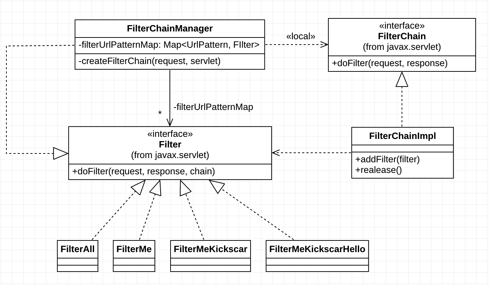

01. Servlet Filter

### JavaEE Application-level Security, Spring Security 그리고 Servlet Filter

세삼스럽지만 Spring은 JavaEE 애플리케이션 개발의 사실상 표준 프레임워크이다. 따라서 Spring Security도 JavaEE 개발의 사실상 "애플리케이션 레벨"의 표준 보안 프레임워크라 할 수 있다. 소프트웨어 시스템의 보안을 다룰 때는 소프트웨어 시스템을 여러 계층(layer)으로 나누고 각 계층별로 세분화 된 보안 주제를 다룬다. 예를 들면, 소프트웨어 시스템을 인프라 계층과 시스템 계층으로 나누어 생각해 볼 수 있다. 인프라 계층에서는 네트워크, 컴퓨팅, 운영체체(OS)등으로 다시 세분화 하여 각각의 레벨에 맞는 보안 주제들을 다룬다. 마찬가지로 시스템 계층도 애플리케이션, 데이터베이스 등으로 나누고 각각의 레벨에 맞는 보안 주제들을 다룰 수 있다.

Spring Security는 소프트웨어 시스템 보안에서 애플리케이션 레벨의 보안에만 집중한다. 애플리케이션 레벨에서 다루게 되는 보안 주제는 인증(Authentication)과 권한(Authorization)이다. Spring Security는 이 주제에 대해 완벽한 구현을 지원한다. 거기에 한 가지 더, 대부분의 JavaEE 애플리케이션들이 웹을 기반하고 있기 때문에 일반적인 웹 공격(OWASP, https://www.owasp.org) 에 대한 대응도 거의 완벽히 지원한다.

Spring 기반의 애플리케이션에서는 실행, 실행환경 그리고 데이터 처리와 저장에 대한 대부분의 로직이 Spring Context 내의 다수의 Bean들로 구현된다. 따라서 Spring Security가 보호해야 할 대상은 Spring Context이며 더 구체적으로는 Spring Context가 관리하는 Bean의 실행이다.

Spring 기반의 애플리케이션에서는 모든 HTTP 요청(HttpRequest)이 Spring Context 내의 특정 Bean의 실행과 매핑된다. 그런데 HTTP 요청을 직접 받는 것은 Servlet Context 내의 DispatcherServlet이다. 따라서 DispatcherServlet이 요청을 받고 이 요청과 매핑된 Bean의 실행을 책임진다. 간단하게 요약했지만 이것이 Spring MVC의 핵심이다.

Spring Context에 대한 보호 책임이 있는 Spring Security는 Servlet Context 내의 DispatcherServlet이 처리하는 모든 요청을 DispatcherServlet 보다 먼저 받아 감시하고 보안 정책을 적용한다. 이를 가능하게 해주는 기술이 Servlet Filter 이다. 보안이 간단치만은 않기 때문에 다수의 보안 Filter들이 순차적으로 감시하게 되며 설정된 보안 정책에 따라 최종적으로는 Servlet의 실행까지 책임지게 된다. 이를 Filter Chain 이라 한다. Spring Security Architecture는 전적으로 Servlet Filter를 기반하고 있다.

그러면 왜? Servlet Security가 아니고 Spring Security 인가? 맞다. Servlet Filter는 이름에도 있지만 Servlet과 함께 Servlet Context에서 관리하는 컴포넌트다. 간단히 던진 질문이 아니기 때문에 대답도 그리 간단하지 않다. 대답을 하기 위해서는 먼저 JavaEE 응용 패턴인 Intercepting Filter 패턴을 Servlet Filter 그리고 Filter Chain과 함께 알아야 한다. 그 다음에 Proxy 디자인 패턴을 기본으로 질문의 대답인 Spring Security Architecture를 이해해야 한다.

### JavaEE Intercepting Filter Pattern

JavaEE 패턴 중 Intercepting Filter에 대한 것은 wiki([https://en.wikipedia.org/wiki/Intercepting\_filter\_pattern](https://en.wikipedia.org/wiki/Intercepting_filter_pattern)) 을 참고한다. 다이어그램들과 함께 잘 설명되어 있다. 요약하면 ....

Intercepting Filter의 구현 전략(Strategy)은 여러 가지가 있다. 모든 전략들이 각각의 쓰임새가 있겠지만 여기서는 Tomcat과 Spring Security에 적용되어 있는 Custom Filter Strategy를 소개한다. 다른 구현 전략들과 비교되는 Custom Filter Strategy 만의 특징은 Filter Chain 이다. Filter Chain에 연결된 각각의 Custom Filter들이 순차적으로 클라이언트의 요청(HttpRequest)에 처리(전처리, Pre-processing)를 추가하고 최종 타겟인 Servlet에게 그 요청을 전달하게 된다. Servlet은 받은 요청을 처리하고 결과를 응답(HttpResponse)에 담아 다시 Filter Chain의 Custom Filter들에게 다시 역순으로 전달한다. 앞의 요청에 대한 전처리와 마찬가지로 응답도 Custom Filter들의 후처리(Post-processing)가 추가되어 최종적으로 클라이언트에게 전달된다.

다소 복잡한 것 같지만 구현 코드와 테스트 코드를 보면 어렵지 않게 이해 할 수 있다. 이 전략은 FilterChain 구현이 필수이다. 그리고 Filter와 FilterChain을 관리하고 요청을 받았을 때 FilterChain을 생성하고 작동(invoke)시키는 FilterChainManager도 추가적으로 필요하다. 구현할 클래스들과 관계들을 클래스 다이어그램로 표현하였다.

다음은 FilterChainManager가 요청에 매핑된 FilterChain을 작동시키는 것 부터 Servlet까지의 요청에 대한 전처리 과정과 응답에 대한 후처리 과정이 시퀀스 다이어그램으로 표현되어 있다. 실제 구현된 코드와 함께 보면 이해에 많은 도움이 될 것이다.

1.  DefaultFilterChain
2.  FilterChainManager
3.  Filter
4.  Test: FilterChainTest

### Spring Security Architecture