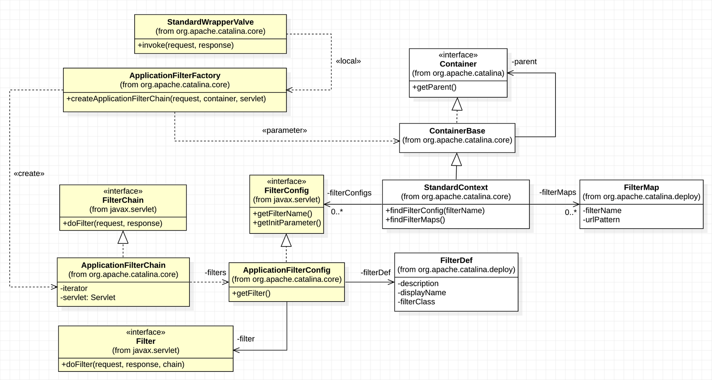
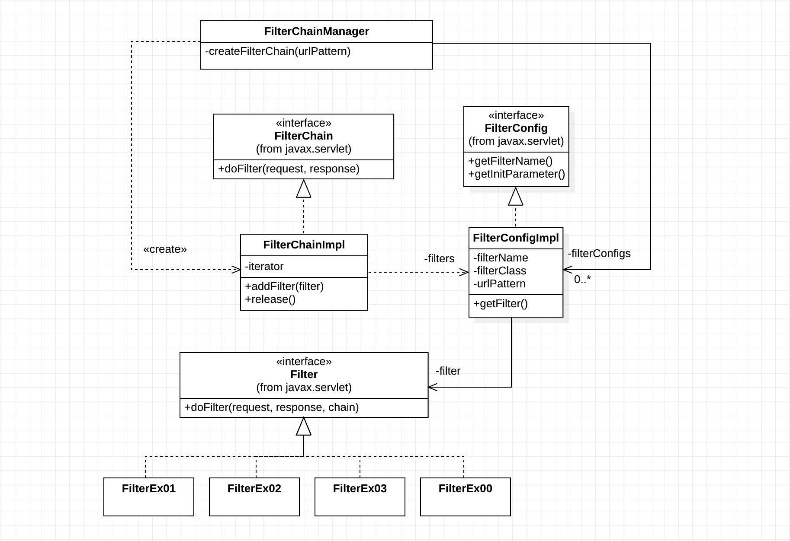
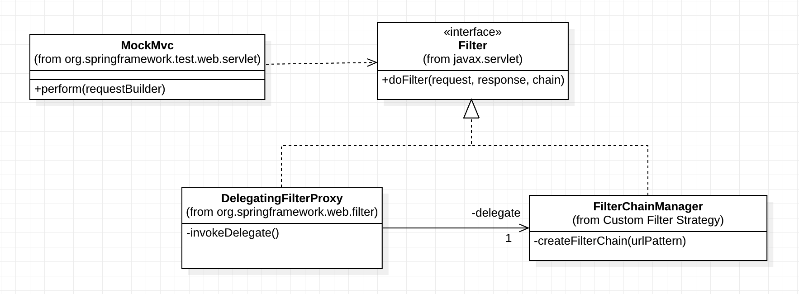
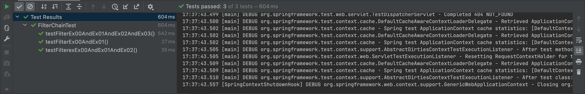

01. Servlet Filter

## Java EE Application-level Security, Spring Security 그리고 Servlet Filter

세삼스럽지만 Spring은 Java EE 애플리케이션 개발의 사실상 표준 프레임워크이다. 따라서 Spring Security도 Java EE 개발의 사실상 "애플리케이션 레벨"의 표준 보안 프레임워크라 할 수 있다. 소프트웨어 시스템의 보안을 다룰 때는 소프트웨어 시스템을 여러 계층(Layer)으로 나누고 계층별 세분화 된 보안 주제를 다룬다. 예를 들면, 우선 소프트웨어 시스템을 인프라 계층과 시스템 계층으로 나눈다. 인프라 계층에서는 네트워크, 컴퓨팅, 운영체체 등의 레벨로 다시 세분화 하여 각 레벨에 맞는 보안 주제를 다룬다. 마찬가지로 시스템 계층도 애플리케이션, 데이터 저장(데이터베이스) 등으로 나누고 각 레벨에 맞는 보안 주제를 다룰 수 있다.

Spring Security는 소프트웨어 시스템 보안에서 애플리케이션 레벨의 보안에만 집중한다. 애플리케이션 레벨에서 다루게 되는 보안 주제는 인증(Authentication)과 권한(Authorization)이다. Spring Security는 이 주제의 완벽한 구현을 지원한다. 여기에 한 가지 더, 대부분의 Java EE 애플리케이션들이 웹을 기반하기 때문에 일반적인 웹 공격(OWASP TOP 10, https://www.owasp.org) 에 대한 대응도 완벽히 지원한다.

Spring 기반의 애플리케이션은 실행, 실행환경 그리고 데이터 처리와 저장에 대한 대부분의 로직이 Spring Context 내의 다수의 Bean들로 구현된다. 따라서 Spring Security가 보호해야 할 대상은 Spring Context이고 더 구체적으로는 Spring Context가 관리하는 Bean의 실행이다.

Spring 기반의 애플리케이션은 모든 HTTP 요청(HttpServletRequest)을 Spring Context 내의 특정 Bean의 실행에 매핑한다. 그런데 HTTP 요청을 직접 받는 것은 Servlet Context 내의 DispatcherServlet 이다. 그렇기 때문에 DispatcherServlet이 요청을 받고 그 요청과 매핑된 Bean의 실행을 책임지게 된다. 간단하게 요약했지만 이것이 Spring MVC의 핵심이다.

Spring Context에 대한 보호 책임이 있는 Spring Security는 Servlet Context 내의 DispatcherServlet이 처리하는 모든 요청을 DispatcherServlet 보다 먼저 감시하고 보안 정책을 적용한다. 이를 가능하게 하는 기술이 Servlet Filter 이다. 보안이 간단치만은 않기 때문에 다수의 보안 필터들이 순차적으로 설정된 보안 정책에 따라 감시하게 되며 최종적으로는 Servlet의 실행까지 책임진다. 이를 Filter Chain이라 한다. Spring Security Architecture는 전적으로 Servlet Filter를 기반하고 있다.

그러면 왜? Servlet Security가 아니고 Spring Security 인가? 맞다. Servlet Filter는 이름에도 있지만 Servlet과 함께 Servlet Context에서 관리하는 컴포넌트다. 간단히 던진 질문이 아니기 때문에 대답도 그리 간단치 않다. 대답을 하기 위해서는 먼저 Java EE 응용 패턴인 Intercepting Filter Pattern을 Servlet Filter 그리고 Filter Chain과 함께 알아야 한다. 그 다음에 Proxy Design Pattern을 기본으로 질문의 대답인 Spring Security Architecture를 이해해야 한다.

## Java EE Intercepting Filter Pattern

Java EE 패턴 중 Intercepting Filter에 대한 내용은 [Intercepting Filter Pattern 위키](https://en.wikipedia.org/wiki/Intercepting_filter_pattern)를 보면 다이어그램들과 함께 잘 설명되어 있다. 요약하면, 요청에 대한 핵심처리(비즈니스)가 있고 여기에 부가적인 처리에 대한 필요가 생겼을 때, 핵심처리 코드의 수정 없이 부가적인 처리 코드를 필터로 구현하여 손쉽게 넣었다 뺐다 하는 패턴이다. Cross-cutting Concern(횡단관심) 분리를 적용할 수 있는 패턴이다. 실제로 Servlet Filter는 Servlet의 비즈니스 구현 코드에서 횡단 관심이라 할 수 있는 Authentication, Logging, Auditing, Data compression, Encoding등과 같은 코드들을 분리 할 때 사용된다.

Intercepting Filter Pattern의 구현 전략(Strategy)은 여러 가지가 있다. 모든 전략들이 각각의 쓰임새가 있겠지만 여기서는 Tomcat과 Spring Security에 적용되어 있는 Custom Filter Strategy를 소개한다. 다른 구현 전략들과 비교되는 Custom Filter Strategy의 특징이 바로 Filter Chain이다. Filter Chain 내부에 연결된 각각의 Custom Filter들이 순차적으로 클라이언트(브라우저)의 요청(ServletRequest)에 처리(전처리, Pre-processing)를 추가하고 최종 타겟이 되는 Servlet에게 그 요청을 전달하게 된다. Servlet은 이 요청을 처리하고 결과를 응답(ServletResponse)에 담아 Filter Chain의 Custom Filter들에게 다시 역순으로 전달한다. 요청에 대한 전처리와 마찬가지로 응답에도 Custom Filter들의 후처리(Post-processing)가 추가되고 이 응답이 최종적으로 클라이언트에게 전달된다.

다소 복잡한 것 같지만 구현 예제와 테스트 코드를 보면 어렵지 않게 이해 할 수 있다. 이 전략은 Filter Chain 구현이 필수다. 그리고 요청을 받았을 때, Filter와 Filter Chain을 생성하고 작동(invoke)시키는 Filter Chain Manager와 유사한 역할의 구현도 추가적으로 필요하다.

### Tomcat의 Intercepting Filter Pattern 구현

앞에서 Intercepting Filter Pattern의 Custom Filter Strategy가 적용된 좋은 사례로 Tomcat과 Spring Security를 잠깐 언급하였다. Intercepting Filter Pattern의 구현 예제와 테스트 코드를 살펴 보기 전에 둘 중에 Tomcat의 구현을 조금 복잡하기는 하지만 잠깐 살펴보자. 다음은 Tomcat의 Filter Chain 생성과 동작에 관련된 클래스들과 그 관계를 표현한 다이어그램이다.



우선, 노랑색으로 표시한 클래스들이 Tomcat에서 Filter와 Filter Chain의 생성과 동작에 직접적 관련이 있다. 나머지 클래스들은 Container 또는 Context라 부르는 Tomcat이 실행하는 웹애플리케이션의 정보 관리와 관련이 있는 클래스들이다. web.xml에 설정하는 Listener, Servlet 그리고 Filter 등의 정보를 관리하게 되는데 특히, 관심을 가져야 하는 것은 StandardContext가 가지고 있는 ApplicationFilterConfig와 FilterMap으로 실제 web.xml에 Filter를 설정하는 내용과 같다. 간단히 다이어그램의 내용을 요약하면,

1.  StandardWrapperValve    
    - 요청(ServletRequest)을 처리(Invoke)한다.

2.  ApplicationFilterChain    
    - 실제로 요청을 처리하는 것은 요청 URL과 패턴이 일치하는 ApplicationFilterChain 안의 Filter들과 하나의 Servlet이다.

3.  ApplicationFilterFactory    
    - ApplicationFilterChain을 생성한다.
    - StandardWrapperValve는 생성된 ApplicationFilterChain 내부의 Filter와 Servlet를 실행한다.
    - Filter Chain을 생성하기 위한 정보를 가지고 있는 Container를 팩토리 메서드 createApplicationFilterChain에서 파라미터로 참조한다.

4.  참고로 Filter Chain에는 ApplicationFilterConfig가 배열로 저장되어 있다. ApplicationFilterConfig가 Filter 생성에 책임이 있다.
    

### Intercepting Filter Pattern 구현 예제

Tomcat 보다는 비교적 간단히 작성된 Intercepting Filter Pattern 구현 예제를 살펴보기 전에 생각해 보아야 할 것은 구현 예제의 테스트(실행) 환경이 Tomcat이 아니라는 것이다. 따라서 Tomcat의 요청 처리 Architecture인 Valve Pipeline에 기반한 컴포넌트 StandardWrapperValve를 예제에서는 FilterChainManager로 대체 하였다. 그리고 Filter Chain도 FilterChainManager가 직접 생성하도록 하였다. 마찬가지로 Container 또는 Context의 구현도 이 예제에서는 필요 없다. 따라서 Filter 정보도 FilterChainManager가 직접 관리하도록 하였다. 그렇게 하면 Tomcat보다 훨씬 간결하고 명확하게 Intercepting Filter Pattern을 코드로 작성해 볼 수 있다. 다음은 구현 클래스들과 그 관계를 표현한 다이어그램이다.



1.  FilterChainManager    
    - Filter 정보를 FilterConfig 배열로 관리하고 FilterConfig를 담은 FilterChain을 생성 한다.
    - Filter Chain을 최초 실행(invoke) 한다.

2.  FilterChainImpl    
    - 인터페이스 Filter Chain의 구현체다.
    - 요청 URL 패턴과 일치하는 FilterConfig를 List로 관리한다.

3.  FilterConfigImpl    
    - 인터페이스 FilterConfig의 구현체다.
    - 이름, URL 패턴 그리고 필터 클래스와 같은 필터 정보를 가지고 있다.
    - 필터 클래스 정보를 가지고 있기 때문에 Filter 생성을 직접 책임진다.

4.  FilterEx00 - FilterEx03    
    - 테스트를 위해 작성한 4개의 간단한 Filter다.
    - 요청에 대한 전처리는 하지 않고 응답에 필터 이름의 간단한 Cookie를 굽는다.

이 구현 예제는 Intercepting Filter Pattern의 이해를 목적으로 하지만 예제의 테스트 환경을 함께 이해하는 것도 중요하다. 왜냐하면 뒤에서 다루게 되는 Spring Security Architecture와 관련이 있기 때문이다. 테스트 환경은 Spring MVC Test Integration으로 Spring Context에서 웹(MVC) 요청을 테스트 하는 환경이다. 당연히 Spring Security를 예제에 적용하지 않았고 테스트에도 사용하지 않지만 앞에서 Spring Securtiy Architecture가 전적으로 Servlet Filter에 기반 한다고 하였다. 따라서 예제의 Filter와 Filter Chain이 Spring MVC Test 환경에서 작동하는 원리는 Spring Securtiy가 Spring MVC에서 작동하는 원리와 동일하다.

1.  Spring Context 설정
    
    ```xml
    <bean id="filterChainManager" class="me.kickscar.spring.security.web.FilterChainManager">
        <property name="filterConfigs">
            <array>
                <bean
                    class="me.kickscar.spring.security.web.FilterConfigImpl"
                    c:filterName="ex00"
                    c:filterClass="me.kickscar.spring.security.filter.FilterEx00"
                    c:urlPattern="/*"/>
                <bean
                    class="me.kickscar.spring.security.web.FilterConfigImpl"
                    c:filterName="ex01"
                    c:filterClass="me.kickscar.spring.security.filter.FilterEx01"
                    c:urlPattern="/ex01/*"/>
                
                [... 생략]
                
            </array>
        </property>
    </bean>
    ```
    
    FilterChainManager를 빈 등록 한다. FilterChainManager는 Filter 정보를 관리하기 때문에 Filter 정보를 담은 FilterConfig 배열을 DI 받는다.
    
2.  테스트 setup
    
    ```java
    @Autowired
    private WebApplicationContext context;
    
    @Autowired
    private FilterChainManager filterChainManager;
    
    private MockMvc mvc;
    
    @BeforeEach
    public void setup() {
        mvc = MockMvcBuilders
                .webAppContextSetup(context).addFilter(new DelegatingFilterProxy(filterChainManager), "/*")
                .build();
    }
    ```
    
    MockMvc가 빌드 되는 과정으로 앞에서 설정한 Spring Context가 Web Application Context로 등록되고 Contoller가 발견되면 빈 등록과 함께 요청 핸들러들이 매핑될 것이다.(테스트에는 Controller는 없다) 그리고 DispatcherServlet이 생성되고 설정되는 등등... 기본적인 Spring MVC와 같은 테스트 환경(MockMvc)이 셋업되는 과정이다. 여기서 눈여겨 봐야 하는 것은 DelegatingFilterProxy라는 필터를 등록하는 부분이다. 실제로 Tomcat 환경이라면 web.xml에 DelegatingFilterProxy를 Servlet Filter로 설정하는 것과 동일하다.


### Proxy Design Pattern

 앞의 예제 클래스 다이어그램에는 표시하지 않았지만 FilterChainManager는 Filter 인터페이스를 구현한 필터로 Spring Context에 빈으로 등록된다. 재밌는 것은 DelegatingFilterProxy가 생성될 때, 생성자를 통해 Delegator로 FilterChainManager가 세팅된다는 사실이다. 따라서 Servlet Context에 등록된 Filter인 DelegatingFilterProxy는 자신이 받은 요청(/*)에 대한 필터 처리를 FilterChainManager에게 전적으로 위임(Delegate)하게 되는데, 위임받은 그 처리가 바로 요청과 매칭되는 Filter들을 가지고 있는 Filter Chain을 생성하여 그 Filter들을 차례로 실행하는 것이다.

 org.springframework.web.filter.DelegatingFilterProxy는 Servlet Context에 등록되어 다른 Context인 Spring Context에 등록된 Filter 빈에게 자신의 이름대로 필터 처리를 위임(Delegating)하는 Proxy 역할만 하는 Servlet Filter다. 예제 테스트에 적용된 Proxy Design Pattern을 클래스 다이어그램으로 잠깐 살펴보자.



 예제 테스트 코드에 적용된 Proxy Design Pattern은 비교적 간단하다. 패턴 구현의 Client쯤 되는 MockMvc가 요청을 테스트하는 perform()에서 자신에 등록된 Filter인 DelegatingFilterProxy의 doFilter()를 호출한다. DelegatingFilterProxy는 doFilter()에서 invokeDelegate()를 호출하여 자신의 Delegator인 FilterChainManager의 doFilter()를 실행한다. FilterChainManager의 doFilter()는 알다시피 Filter Chain 생성과 Filter Chain 내부 Filter들의 doFilter() 호출한다. 다음은 테스트 코드와 그 결과이다.

```java
    @Test
    public void testFilterEx00AndEx01() throws Throwable {
        mvc
            .perform(get("/ex01/test"))
            .andExpect(status().isNotFound())
            .andExpect(cookie().value("FilterEx00", "Works"))
            .andExpect(cookie().value("FilterEx01", "Works"));
    }

    @Test
    public void testFilterexEx00AndEx01AndEx02() throws Throwable {
        mvc
            .perform(get("/ex01/ex02/test"))
            .andExpect(status().isNotFound())
            .andExpect(cookie().value("FilterEx00", "Works"))
            .andExpect(cookie().value("FilterEx01", "Works"))
            .andExpect(cookie().value("FilterEx02", "Works"));
    }

    @Test
    public void testFilterEx00AndEx01AndEx02AndEx03() throws Throwable {
        mvc
            .perform(get("/ex01/ex02/ex03/test"))
            .andExpect(status().isNotFound())
            .andExpect(cookie().value("FilterEx00", "Works"))
            .andExpect(cookie().value("FilterEx01", "Works"))
            .andExpect(cookie().value("FilterEx02", "Works"))
            .andExpect(cookie().value("FilterEx03", "Works"));
    }
```

 특정 URL에 매핑된 필터들이 응답에 자신의 이름으로 추가한 Cookie의 내용("Works")을 확인하는 간단한 테스트다. 참고로 간소하게 필터들만 테스트할 목적으로 요청 URL에 매핑된 핸들러(Controller)는 따로 작성하지 않았다. 따라서 Not Found(404)가 데스트 성공이다. 
 



## Spring Security Architecture

 드뎌~~ 스프링 시큐리티 아키텍처이다!!!!