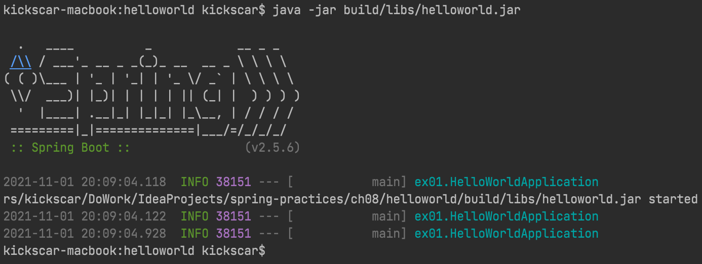
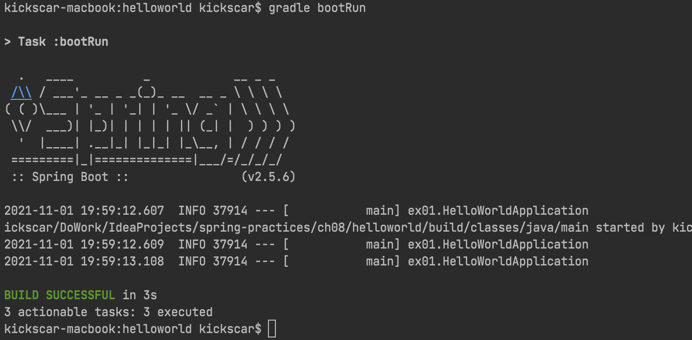

1. 시작하기

## Spring Boot

부트(Boot 또는 Booting)라는 용어는 보통, 컴퓨터(OS)가 전원이 켜지는 순간부터 사용자로 부터 명령을 받을 준비가 될 때까지 걷치는 일련의 과정을 일켣는다. 이 용어는 원래 가죽 신발에 발뒷꿈치를 넣기 쉽도록 하기위해 달려있는 부트스트랩(Bootstrap)에서 유래된 용어인데 '어떤 일을 시작하기 위해 필요한 모든 준비를 마친다'는 의미로 사용된다. 스프링 부트(Spring Boot)에서 부트도 이 의미와 크게 다르지 않다.

스프링 부트는 스프링 애플리케이션을 시작하기 위해 필요한 모든 준비를 자동으로 마쳐주는 라이브러리 또는 도구(Tool)이다. 대부분의 스프링 애플리케이션들의 시작을 위해 필요한 준비는 대략 다음과 같을 것이다.

1.  애플리케이션 기능(비즈니스)의 구현 코드
2.  애플리케이션 설정

대부분의 많은 강력한 라이브러리 또는 도구들은 다양한 비즈니스 구현 코드를 자동으로 작성해 주지는 못 할 것이다. 하지만, 애플리케이션 설정은 자동으로 해 줄 수 있다. 그 이유는 뒤에서 다시 언급하겠지만 그 설정이 유사하고 반복적이며 상투적(Boilerplate)이기 때문이다. 스프링 부트는 애플리케이션 구현 코드가 시작되기 위해 필요한 준비 중에 하나인 애플리케이션의 유사하고 반복적인 설정을 자동으로 하는 스프링 라이브러리 도구이다.

스프링을 기반으로 하는 자바 엔터프라이즈 개발(JEE)에서는 EJB 기능을 POJO로 구현하기 때문에 작성되는 코드는 전반적으로 가볍다. 하지만 개발과 애플리케이션 구성은 무겁고 복잡하다. 이를 극복하려는 노력은 꾸준히 지속되어 왔고 어느정도 성과도 있었지만 여전히 스프링은 복잡한 설정에서 벗어나지 못했다. 거기에 프로젝트 또는 라이브러리들 간의 의존성 문제도 여간 성가신게 아니다. 의존 라이브러리의 버전을 잘못 선택해서 빌드가 깨지거나 실행 중 예외가 발생하는 것은 스프링 프로젝트에서는 흔한 일이라 세삼스러울 것도 없다. 스프링 부트는 이런 문제들을 해결했다. 스프링 부트는 개발자가 직접 하던 스프링의 복잡하고 반복적인 설정을 관례에 따르는 자동 설정(Automatic Configuration)으로 제거했다. 개발자가 직접 이름과 버전을 명시하던 라이브러리들 간의 의존성은 이제 스프링 부트의 스타터 의존성(Stater Dependency)이 관리한다. 개발자는 스타터 의존성만 명시하는 방식으로 의존성을 지정만 해주면 라이브러리들 간의 버전 문제로 발생했던 이전의 문제들은 깔끔히 해결된다.

하지만, 모든 것이 자동으로 설정된다고 편리하고 좋은 것만은 아니다. 직접 Java 또는 XML로 설정 작업을 하던 전통적인 스프링은 의도한대로 그리고 설정한대로 작동하기 때문에 설정 작업이 복잡하고 귀챦기는 하지만 내부에서 어떤 일이 일어나는 지 잘 알 수 있고 문제 대응도 비교적 쉽다. 스프링 부트의 자동 설정은 처음에는 편리하게 느껴질지도 모르겠지만 스프링 부트를 이해하지 못하면 전통적인 스프링보다 더 어렵고 문제 대응도 어렵다. 스프링 부트를 잘 사용하려면 스프링 부트 내부에서 일어 나는 일들을 이해하고 있어야 한다. 그리고 오해하지 말아야 할 것은 스프링 부트가 모든 설정을 다 해주는 도구가 아니다. 자동 설정을 통해 장황하고 반복적인 설정을 간소화한 도구이지 모든 설정을 없앤 도구가 아니다. 따라서 자동 설정을 오버라이드 하거나 정밀하게 조정하는 작업이 반드시 필요하다.

## Hello World

앞에서도 언급했지만 스프링 부트의 핵심 기술은 1.스타터 의존성(Stater Dependency)과 2. 자동 설정(Automatic Configuration)이다. 이 기술들을 자세히 알아보기 전에 스프링 부트 프로젝트의 구조와 빌드 및 실행 등을 먼저 이해하는 것이 순서다.

ch08/helloworld 프로젝트를 보면, 일반적인 jar 패키징 그레이들(gradle) 또는 메이븐(maven) 프로젝트와 별반 다르지 않다. 어차피 스프링 부트 애플리케이션도 자바 애플리케이션이기 때문에 그레이들 또는 메이븐 프로젝트로 작성될 수 있다. 두 형식의 프로젝트는 코드와 리소스의 디렉토리 형식은 동일하지만 기본 빌드 디렉토리와 설정 방법이 다르고 서로 영향을 주지 않기 때문에 하나의 프로젝트로 합쳤다. 그레이들을 기준으로 스프링 부트 프로젝트의 설정과 빌드를 먼저 살펴보고 메이븐 설정도 비교하여 다시 살펴본다.

### 스프링 부트스트래핑(Spring Bootstrapping)

\[예제: ex01.HelloWorldApplication\]

```java
@SpringBootApplication
public class HelloWorldApplication {
    public static void main(String[] args) {
        SpringApplication.run(HelloWorldApplication.class, args);
    }
}
```

코드를 보면, 클래스 HelloWorldApplication에 CLI 애플리케이션의 엔트리(Entry)인 main() 메서드가 있다. 스프링 부트 애플리케이션은 CLI 실행의 jar 패키징이 일반적이다. 그런데 보통의 스프링 애플리케이션은 war 패키징 배포의 웹 애플리케이션이 절대 다수다. 물론, 스프링 부트 기반의 웹 애플리케이션도 여러가지 방법으로 전통적인 war 패키징 형태로 서버(WAS)에 배포할 수 있다. 하지만, 애플리케이션과 서버(Embedded)가 함께 예제처럼 jar 패키징되어 배포되는 것이 최근의 엔터프라이즈 클라우드 환경의 배포에 최적임도 이해해야 한다. 참고로 예제에서는 빌드 시, 스프링 부트가 웹 애플리케이션이 아니라는 것을 알고 있기 때문에 내장 서버가 패키징되지 않는다. 코드만 보면, main() 메소드 안의 한 줄 SpringApplication.run() 메서드 안에서 많이 일이 일어날 것이라 짐작하는 것이 그리 어렵지 않은데 실제로 많은 일이 벌어진다.

1.  애플리케이션 컨텍스트(Application Context, 스프링 컨테이너) 생성
2.  애플리케이션 타입 결정
3.  어노테이션 스캐닝을 통한 빈 생성 및 등록
4.  웹 애플리케이션인 경우
    - 내장 서버(TomcatEmbeddedServletContainer) 인스턴스 생성
    - 서버 인스턴스에 애플리케이션 배포(Deploy)
    - 서버 인스턴스 실행
5.  컨테이너에서 인터페이스 ApplicationRunner 구현 빈의 run() 실행

이와 같은 일이 main() 메서드의 실행으로 일어 나기 때문에 HelloWorldApplication 클래스는 부트스트래핑 역할을 하는 말그대로 부트스트랩 클래스이다. 이제 1번에서 5번까지의 작업들을 살펴 보자. 먼저, 2번과 4번은 시작해야 할 애플리케이션이 웹 애플리케이션인 경우에만 적용된다. 따라서 이 내용은 뒤에서 자세히 살펴보고 웹 애플리케이션을 포함한 일반적인 스프링 부트 애플리케이션에 공통적으로 적용되는 작업과 관련된 내용들을 살펴보자.

1번 애플리케이션 컨텍스트(스프링 컨테이너)를 생성에서는 알다시피 빈 와이어링 정보를 xml 파일 또는 Java 클래스로 전달해야 한다. 예제 코드에서 SpringApplication.run() 메소드 호출의 첫 번째 아규먼트(Argument)로 전달하는 HelloWorldApplication 클래스가 바로 컨테이너 설정 클래스이다. 여기서 HelloWorldApplication 클래스가 앞서 언급했던 부트스트랩핑 역할 외에 한 가지 더 애플리케이션 컨텍스트 설정 클래스 역할도 한다는 것을 알 수 있다. 정리하면,

1.  스프링 부트 애플리케이션의 부트스트래핑 역할
2.  스프링 부트 애플리케이션의 설정 클래스 역할

1번은 설명되었으니 2번 설정(Configuration) 클래스 역할을 테스트 코드들과 살펴보자.

### 스프링 부트 애플리케이션 설정 (Spring Boot Application Configuration)

ch08/myapplication 프로젝트에서 설정 클래스로의 부트스트래핑 클래스의 역할을 살펴본다. 앞의 helloworld.HelloWorldApplication 클래스에 붙은 @SpringBootApplication에 대한 설명은 잠시 뒤로 미루고 대신, 보통 스프링 애플리케이션의 설정 클래스에 붙히는 @Configuration을 붙히고 시작해 보자.

\[예제: ex01.MyApplication\]

```java
@Configuration
public class MyApplication {
   @Bean
    public MyComponent myComponent() {
        return new MyComponent();
    }

    public static void main(String[] args) {
        try (ConfigurableApplicationContext c = SpringApplication.run(MyApplication.class, args)) {
        }
    }
}
```

실제적인 부트스트래핑 메소드 main()만 빼면, MyComponent 빈 등록하는 메소드 하나만 있는 비교적 간단한 일반적인 스프링 설정 클래스다. 이제 테스트 코드를 살펴보자.

\[Test: ex01.MyApplicationTest01\]

```java
@ExtendWith(SpringExtension.class)
@ContextConfiguration(classes={MyApplication.class})
public class MyApplicationTest01 {
    @Autowired
    private MyComponent myComponent;

    @Test
    void myComponentNotNull() {
        assertNotNull(myComponent);
    }
}
```

일반적인 스프링 환경의 테스트 코드이다. 기본 ApplicationContext 구현 클래스는 AnnotationConfigApplicationContext 이다. 당연히 테스트는 성공한다. 다음에 살펴볼 MyApplicationTest02는 스프링 부트에서 지원하는 @SpringBootTest을 사용한다. 이 애노테이션은 @ExtendWith와 @ContextConfiguration을 묶어 놓은 것이지만 다른 기능이 몇개 더 있다.

\[Test: ex01.MyApplicationTest02\]

```java
@SpringBootTest
public class MyApplicationTest02 {
    @Test
    public void contextLoad() {
    }
}
```

이 테스트는 컨테이너가 제대로 설정되지 않기 때문에 Application Context 로딩 자체가 되지 않는다. 물론, MyApplicationTest02의 @ContextConfiguration 처럼 설정 클래스를 @SpringBootTest에 지정하면 테스트가 성공할 것이다. 하지만 보통, 스프링 부트 테스트 케이스에서는 생략하고 설정 클래스를 스캔하도록 한다.

스캔이 되기 위해서는 같은 패키지에 설정 클래스를 작성하고 @Configuration 대신 스프링 부트 전용인 @SpringBootConfiguration를 사용한다. @SpringBootConfiguration은 하위 패키지의 @Configuration을 달고 있는 모든 설정 자바 클래스를 자동으로 import 한다. 유의해야 할 점도 있지만 편리한 점이 많다. 예제에 수정한 설정 클래스와 테스트 케이스도 함께 작성했으니 참고한다.

\[예제: ex02.MyApplication\]

```java
@SpringBootConfiguration
public class MyApplication {
    @Bean
    MyComponent myComponent() {
        return new MyComponent();
    }

    public static void main(String[] args) {
        try (ConfigurableApplicationContext c = SpringApplication.run(MyApplication.class, args)) {
        }
    }
}
```

\[Test: ex02.MyApplicationTest\]

```java
@SpringBootTest
public class MyApplicationTest {
    @Autowired
    private MyComponent myComponent;

    @Test
    void testMyComponentNotNull() {
        assertNotNull(myComponent);
    }
}
```

다음 예제는 @ComponentScan의 테스트이다. MyComponent 빈 생성을 앞의 예제처럼 명시적(Explicit)으로 하지 않고 스캐닝으로 자동으로 하기위해 애노테이션을 사용했다. 예제를 살펴보자.

\[예제: ex03.MyApplication\]

```java
@SpringBootConfiguration
@ComponentScan
public class MyApplication {
    public static void main(String[] args) {
        try (ConfigurableApplicationContext c = SpringApplication.run(MyApplication.class, args)) {
        }
    }
}
```

명시적인 빈 설정이 사라지고 대신 애노테이션 기반 자동 설정을 위해 @ComponentScan을 사용했다. basePackages 등의 별도의 값을 지정하지 않으면 현재 package의 하위 패키지를 모두 스캐닝 한다. 다음은 MyComponent 클래스 예제 코드다.

\[예제: ex03.component.MyComponent\]

```java
@Component
public class MyComponent {
}
```

@Component을 사용했고 하위 패키지 스캐닝의 테스트를 위해 ex03.component 패키지에 작성했다. 테스트는 앞의 예제 테스트와 같은 MyComponent 빈 주입 여부이다.

\[Test: ex03.MyApplicationTest\]

```java
@SpringBootTest
public class MyApplicationTest {
    @Autowired
    private MyComponent myComponent;

    @Test
    void testMyComponentNotNull() {
        assertNotNull(myComponent);
    }
}
```

테스트는 성공할 것이다. 지금까지 부트스트래핑 클래스가 애플리케이션 컨텍스트 설정 클래스로 작동하는 것을 앞의 예제들로 확인해 보았다. 앞에서 언급한 부트스트래핑 다섯 가지 과정 중에 1, 3번 과정까지의 진행을 이해했을 것이다. 2, 4번은 웹 애플리케이션에서만 적용되기 때문에 뒤에서 자동 구성(Automatic Configuration)과 함께 따로 다룰 것이다. 이제 최초 예제 HelloWorld에서 사용했던 @SpringBootApplication이 어떤 역할을 하는 지 대략 짐작할 수 있을 것이다.

@SpringBootApplication은 방금 테스트 한 @SpringConfiguration, @ComponentScan을 묶어 놓은 것이다. 여기에! 스프링 부트의 두 가지 핵심 기술 중에 자동 구성을 가능하게 하는 @EnableAutoConfiguration도 함께 묶고 있다. 사실, 이 애노테이션으로 수 많은 설정 코드를 대체할 수 있다. 그런데, 지금 까지의 예제들은 자동 구성을 할 것이 없다. 이는 뒤에서 자동 구성할 꺼리가 있는 웹 애플리케이션 코드를 직접 작성하면서 설명한다. ex04는 @SpringBootApplication으로 지금까지 살펴 보았던 @SpringBootConfiguration과 @ComponentScan을 대체하는 직접적인 예제이다.

마지막으로 살펴 볼 내용은 부트스트래핑 과정의 마지막 단계인 '5\. ApplicationRunner 인터페이스 구현 빈의 run() 실행' 이다. 이는 해당 빈이 없으면 하지 않는다. 만약 애플리케이션 컨텍스트가 초기화 된 후, 실행할 코드가 있다면 ApplicationRunner 인터페이스를 구현한 클래스를 빈 등록을 하면 된다. 애플리케이션 컨텍스트의 초기화 후 실행할 코드라 했으므로 실행할 코드가 애플리케이션 컨텍스트 환경의 빈들에 의존성이 있는 코드일 것이다. ex05는 간단히 ApplicationRunner의 사용 방법을 보여주는 예제이다.

\[예제: ex05.MyApplication\]

```java
@SpringBootApplication
public class MyApplication {
    @Bean
    ApplicationRunner applicationRunner() {
        return new ApplicationRunner () {
            @Autowired
            private MyComponent myComponent;

            @Override
            public void run(ApplicationArguments args) throws Exception {
                myComponent.printHello();
            }
        };
    }

    public static void main(String[] args) {
        try (ConfigurableApplicationContext c = SpringApplication.run(MyApplication.class, args)) {
        }
    }
}
```

\[예제: ex05.component.MyComponent\]

```java
@Component
public class MyComponent {
    public void printHello() {
        System.out.println("Hello World");
    }
}
```

## 스프링 부트 프로젝트 빌드

앞에서도 잠깐 언급했지만 스프링 부트 프로젝트는 일반적인 자바 jar 패키징 그레이들 또는 메이븐 프로젝트와 별반 다르지 않다. 스프링 부트 애플리케이션도 자바 애플리케이션이기 때문에 그레이들 또는 메이븐 프로젝트로 작성될 수 있다. 그리고 스프링 부트는 그레이들 또는 메이븐 플러그인을 각각 제공하는데 그 사용 방법을 알아본다.

### 그레이들 빌드

우선, helloworld 프로젝트의 그레이들 매니페스트(manifest) 파일인 build.gradle의 내용을 살펴보자.

\[예제: helloworld/build.gradle\]

```
plugins {
    id 'org.springframework.boot' version '2.5.6'
    id 'io.spring.dependency-management' version '1.0.11.RELEASE'
    id 'java'
}

group 'springboot'
version '1.0-SNAPSHOT'
sourceCompatibility = '1.8'

project.archivesBaseName = 'helloworld'
project.version = ''

repositories {
    mavenCentral()
}

dependencies {
    implementation 'org.springframework.boot:spring-boot-starter'
    testImplementation 'org.springframework.boot:spring-boot-starter-test'
}

test {
    useJUnitPlatform()
}
```

맨 처음, 세 개의 그래이들 플러그인을 확인할 수 있는데 자바 소스 컴파일을 위한 자바 플러그인, 스프링 부트 플러그인 그리고 의존성 관리 플러그인이 존재한다. 먼저, 의존성 관리 플러그인은 스타터들의 의존성 뿐만 아니라 애플리케이션 개발에 많이 사용되는 의존성들의 버전간 충돌과 안정성 등이 검증된 버전들을 관리한다. 따라서 스프링 부트의 그래이들 또는 메이븐 매니페스트에서는 대부분 의존성의 버젼을 명시하지 않아도 된다. 다음의 스프링 부트 플러그인은 프로젝트를 실행가능한 jar(uber jar)로 패키징 하는 것을 주기능으로 한다. 이 플러그인의 태스크(task)를 실행해서 빌드와 실행을 테스트 해 보자.

```bash
$ gradle clean bootJar

BUILD SUCCESSFUL in 1s
4 actionable tasks: 4 executed
$ 
```

 bootJar 태스크는 우버 jar 파일로 프로젝트를 빌드와 패키징한다. 따라서 바로 실행할 수 있다. 그레이들은 기본적으로 build/libs에 패키징한다. 참고로 편의를 위해 project.archivesBaseName에 'helloworld' 그리고 패키징에 붙는 버젼은 뺐다.



한편, 바로 실행하기 위해서는 bootRun 태스크를 실행할 수 있다. 주의할 것은 jar 패키징을 하지 않고 실행만 한다.



 

### 메이븐 빌드